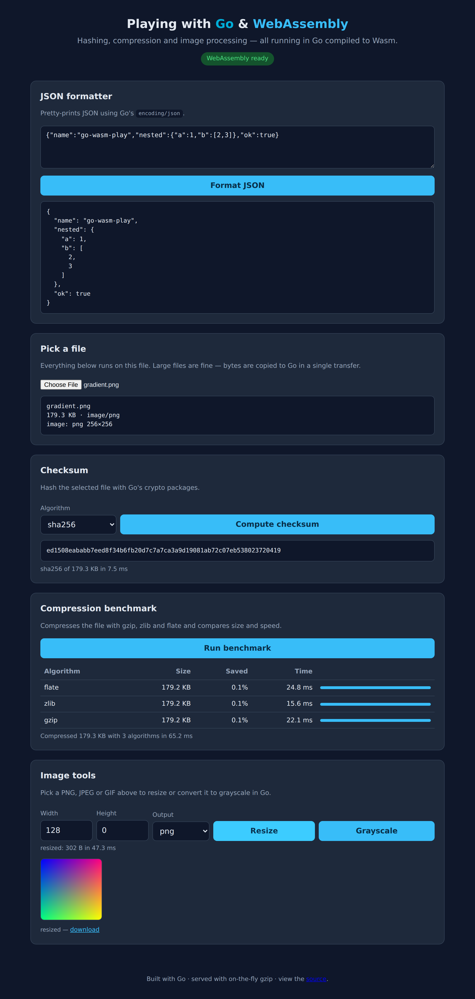

# Playing with Go and WebAssembly

[](https://github.com/lao/go-wasm-play/actions/workflows/ci.yml)
[](https://go.dev/)
[](https://webassembly.org/)
[](go.mod)
[](LICENSE)

A small playground that compiles **Go to WebAssembly** and drives it from the browser.
It began as the [golangbot Wasm tutorial](https://golangbot.com/webassembly-using-go/) and
now demonstrates file hashing, multi-algorithm compression with benchmarking, and image
processing — all executed by Go running as Wasm, with results returned to JavaScript through
`async`/`await` Promises.

The whole thing has **zero third-party Go dependencies** (everything is standard library).



## Features

Each item below was an open TODO in earlier versions of this repo; they are now implemented
and exercised by the test suite.

- **JSON formatter** — pretty-prints JSON with `encoding/json`.
- **File checksums** — hash any file picked from an `<input type="file">` with `md5`, `sha1`,
  `sha256` or `crc32`.
- **Compression benchmark** — compress a file with `gzip`, `zlib` and `flate` and compare the
  resulting size and time side by side.
- **Image processing** — decode PNG/JPEG/GIF, resize with bilinear interpolation (aspect-ratio
  aware) or convert to grayscale, then re-encode as PNG or JPEG.
- **Async by default** — the heavy operations are exposed as Promise-returning functions, so the
  page stays responsive and errors reject the Promise instead of silently failing.
- **Big files** — bytes are transferred between JS and Go with a single bulk `CopyBytes` call,
  and on-the-fly gzip in the server keeps the ~4 MB Wasm download closer to ~1.2 MB on the wire.

## Project layout

```
.
├── assets/                # static files served to the browser
│   ├── index.html         # the playground UI (vanilla JS, no build step)
│   ├── wasm_exec.js       # Go's Wasm support shim (copied from the toolchain)
│   └── json.wasm          # the compiled module (produced by `make build`)
├── cmd/
│   ├── server/            # tiny static file server with gzip
│   └── wasm/              # the WebAssembly entry point and JS bindings
├── internal/
│   ├── ops/               # pure-Go hashing / compression / image logic (unit tested)
│   └── web/               # dependency-free gzip middleware
├── test/wasm_smoke.mjs    # Node end-to-end test of the built Wasm module
└── Makefile
```

The logic lives in `internal/ops`, which imports **no** `syscall/js` and is therefore portable
and unit-testable on the host toolchain. `cmd/wasm` is a thin layer that binds those functions
to JavaScript globals.

## Getting started

### Prerequisites

- [Go 1.24+](https://go.dev/dl/)
- [Node.js 18+](https://nodejs.org/) — only needed to run the Wasm smoke test

### Build and run

```bash
# build the Wasm bundle (also refreshes assets/wasm_exec.js) and serve it
make run
# → serving ./assets at http://localhost:9090
```

Then open <http://localhost:9090> and pick a file.

Useful targets (`make help` lists them all):

| Target            | What it does                                              |
| ----------------- | -------------------------------------------------------- |
| `make build`      | compile `cmd/wasm` to `assets/json.wasm` + copy the shim |
| `make run`        | build, then start the asset server on `:9090`            |
| `make test`       | run the Go unit tests **and** the Wasm smoke test        |
| `make vet`        | `go vet` for both the host and the Wasm build            |
| `make clean`      | remove the generated Wasm binaries                       |

The server is configurable via flags or environment variables:

```bash
go run ./cmd/server --addr :8080 --dir ./assets   # or ADDR=:8080 ASSETS_DIR=./assets
```

## How it works

The exported JavaScript API (set up in [`cmd/wasm/main.go`](cmd/wasm/main.go)):

| JS function                              | Returns            | Notes                              |
| ---------------------------------------- | ------------------ | ---------------------------------- |
| `formatJSON(text)`                       | `string`           | synchronous                        |
| `md5Hash(text)`                          | `string`           | synchronous, kept for compat       |
| `checksum(algo, bytes)`                  | `Promise<string>`  | `md5` / `sha1` / `sha256` / `crc32`|
| `compress(algo, bytes)`                  | `Promise<object>`  | size + ratio + timing              |
| `benchmarkCompression(bytes)`            | `Promise<array>`   | every algorithm, sorted by size    |
| `imageInfo(bytes)`                       | `Promise<object>`  | `{format, width, height}`          |
| `resizeImage(bytes, w, h, format)`       | `Promise<Uint8Array>` | `h<=0` keeps the aspect ratio   |
| `grayscaleImage(bytes, format)`          | `Promise<Uint8Array>` |                                 |

`bytes` is a `Uint8Array` (e.g. `new Uint8Array(await file.arrayBuffer())`). The Go side turns
a heavy operation into a Promise by running it in a goroutine and resolving/rejecting from there,
which is why the UI can `await` it without blocking the event loop.

## Testing

```bash
make test        # go test ./...  +  Node end-to-end smoke test
```

- **Unit tests** (`internal/ops`, `internal/web`) cover known-answer checksums, compression
  round-trips, image resize/grayscale, the gzip middleware, and multi-megabyte "big file" inputs.
  There are also Go benchmarks (`go test -bench=. ./internal/ops`).
- **End-to-end** ([`test/wasm_smoke.mjs`](test/wasm_smoke.mjs)) loads the real `json.wasm` through
  `wasm_exec.js` in Node and exercises every exported function, including Promise rejection on bad
  input.

### Continuous integration

A ready-to-use GitHub Actions pipeline (gofmt, vet, unit tests, Wasm build, smoke test)
ships at [`.github/ci.yml`](.github/ci.yml). Enable it by moving it into the workflows
directory:

```bash
git mv .github/ci.yml .github/workflows/ci.yml
```

It lives outside `workflows/` only because the token that created this branch lacks
GitHub's `workflow` scope; once moved, the CI badge above goes live.

## TinyGo (experimental)

[TinyGo](https://tinygo.org/) can produce a much smaller binary:

```bash
make tinygo      # writes assets/tiny-go/json.wasm — requires tinygo on your PATH
```

This is best-effort: TinyGo's standard-library coverage is partial, so the image and compression
features may not build under it. The original size-comparison demo lives in
[`assets/index-tiny-go.html`](assets/index-tiny-go.html).

> **Note:** TinyGo historically tripped over `syscall/js.finalizeRef`
> (see [tinygo#1140](https://github.com/tinygo-org/tinygo/issues/1140)).

## Credits

Originally based on the golangbot [WebAssembly using Go](https://golangbot.com/webassembly-using-go/)
tutorial. Binary-size tips from [Minimizing Go WebAssembly binary size](https://dev.bitolog.com/minimizing-go-webassembly-binary-size/).

## License

[MIT](LICENSE)
